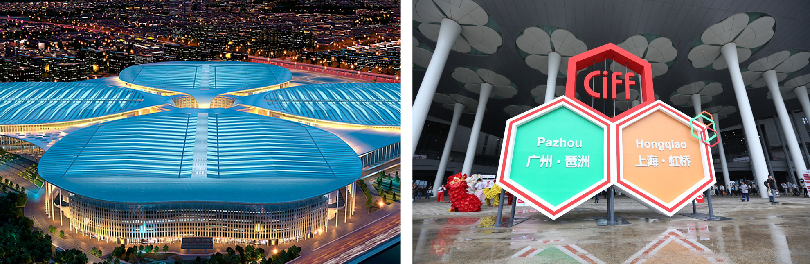
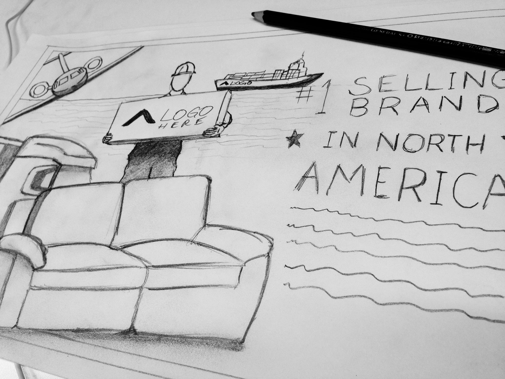
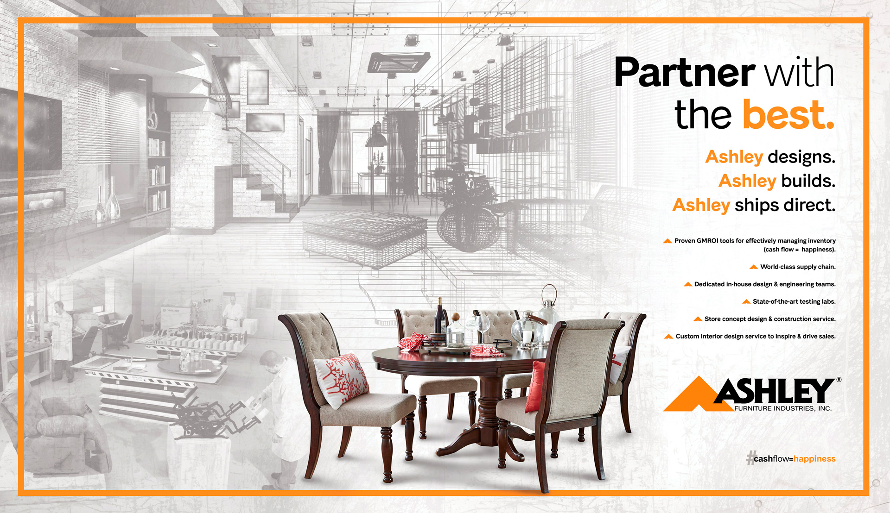
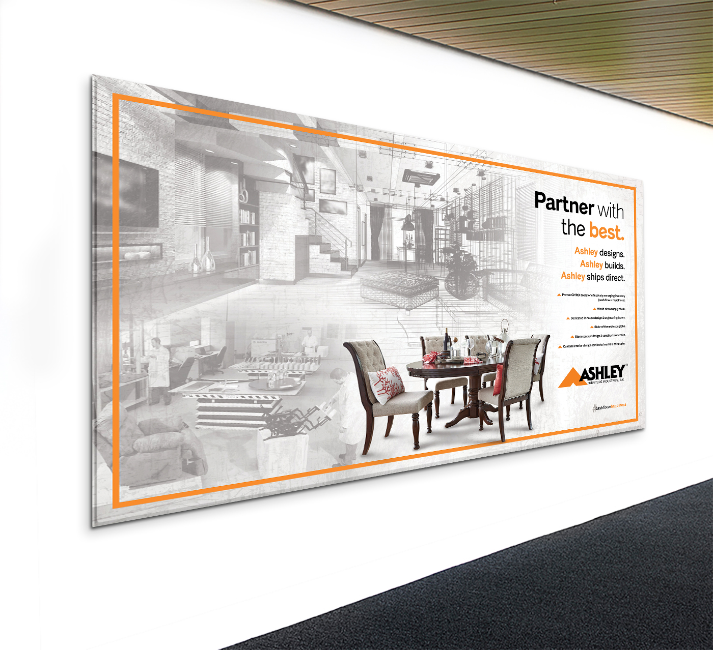
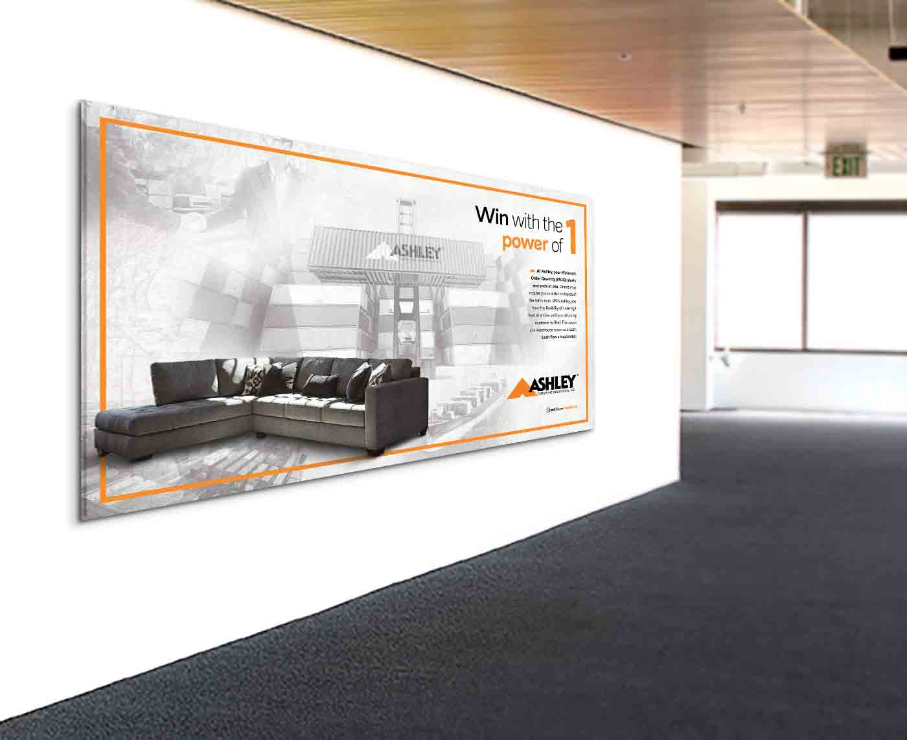
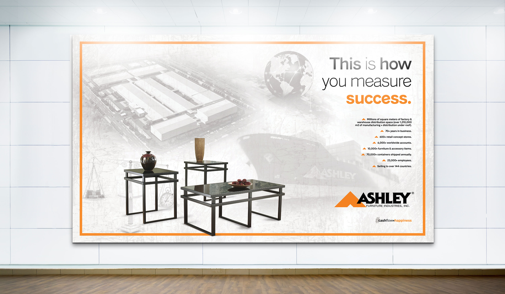
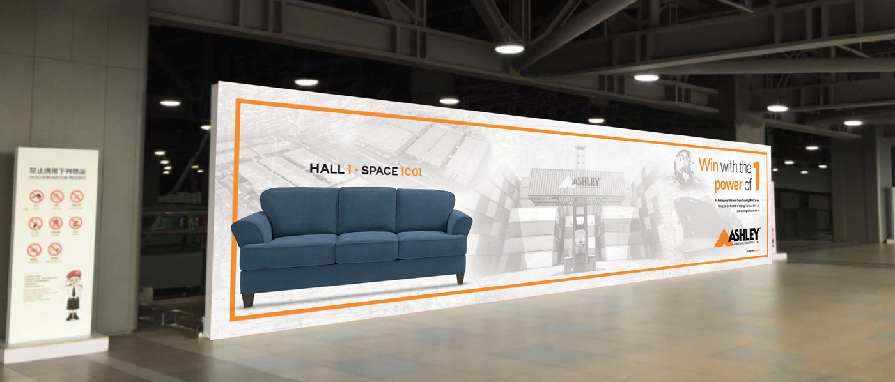

### Concept

Every 3-4 months, I was privileged to be tasked with the entire design materials needed for their marketing campaign of over \$250,000 net worth. From the outdoor to indoor signage, to magazine ads, eblast and more. Here I will be covering the major outdoor and indoor signage created for the beautiful National Exhibition and Convention Center in the picture above, staged in Shanghai.

As a designer, I was taught and always strongly believed that the concept is the most important element of the principles of design, therefore, each graphic is first created with the pencil before putting it to pixels. I then present it to the creative team and send it for approval to the president of international.

### Indoor & Outdoor Signage

The indoor and outdoor signage consists of wall murals and billboards that go around the entire booth and throughout the Convention Center in which Ashley showcases itself to the hundreds of potential clients and traffic flowing by.

The main concept here is to bring something different to the more typical look and feel of Ashley by using a bit more of an industrial, grungy look, meanwhile maintaining the classy and elegant look that it more commonly displays. Bringing more attention to the product by taking away the color of the background graphics, containing the product with a border in it’s brand centric hue of orange all consistently throughout the entire campaign. Each background graphically relates to the verbiage, cohesively conveying its intended message.

