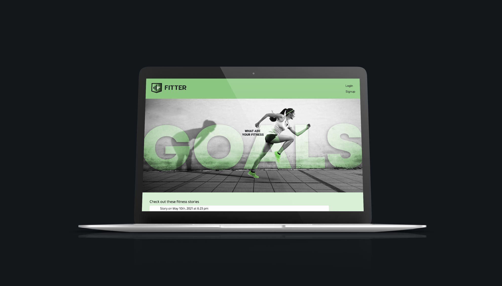
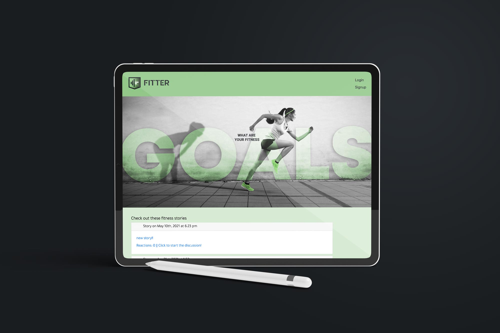
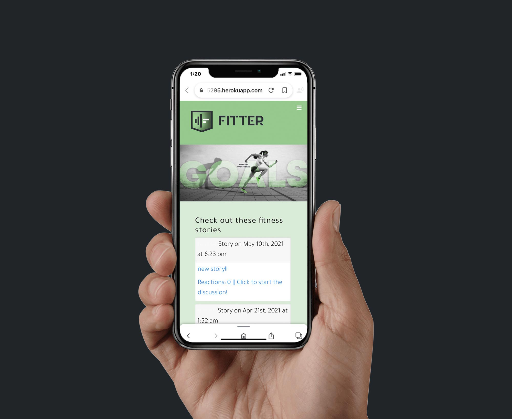

### A Full Stack Web Development group [project](https://github.com/valiantcreative33/FITTER) created during my coding Boot Camp at the University of Central Florida.

FITTER is a health and fitness application that allows users to set initial goals using a self assessment quiz, and daily goals using your personal calendar. Users can share personal stories to motivate each other.

This was also a project I collaborated on while undergoing a Full Stack Web Development Boot Camp at the University of Central Florida. My primary role here was as the Front End Developer. I Personally designed the logo and lead the majority of the UI/UX of the entire application, as well as hand coded the majority of the Front End.

View the live project [here](https://frozen-ravine-95295.herokuapp.com/).

