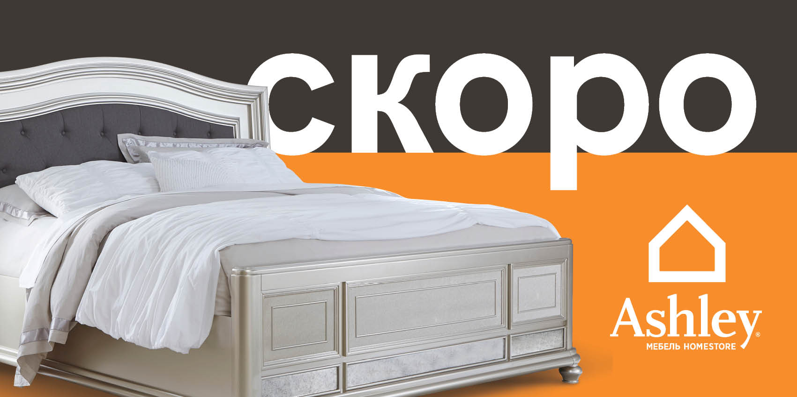

Ashley Furniture Industries is the #1 Furniture Manufacturer in the World, and the #1 furniture retailer in North America. There are now more than 600 Ashley HomeStore’s and 15 manufacturing and distribution facilities across the globe. Their products are sold by more than 6000 retail partners with over 20,000 storefronts in 123 countries and their manufacturing and distribution facilities cover more than 13,000,000 ft2.

This is a billboard design done as part of a campaign held for the grand opening of the store in Ufa, Russia. Art direction and design were all created by myself, from concept to the finished product. The images below are real life shots of the billboards throughout the city of up to 9 different locations, along with a Photoshopped mockup as well.

