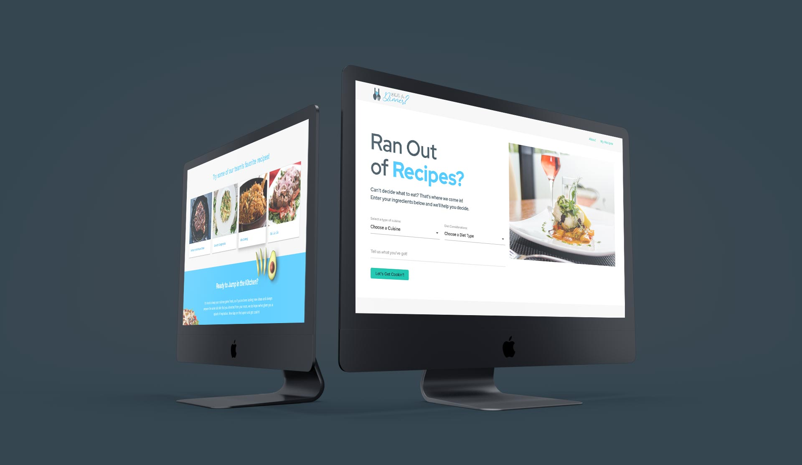
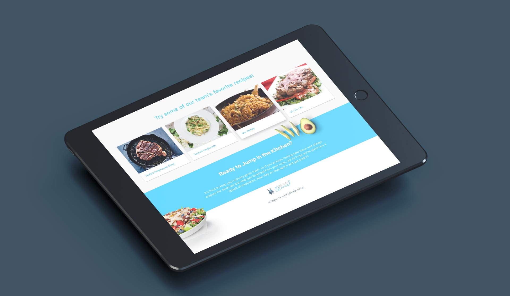
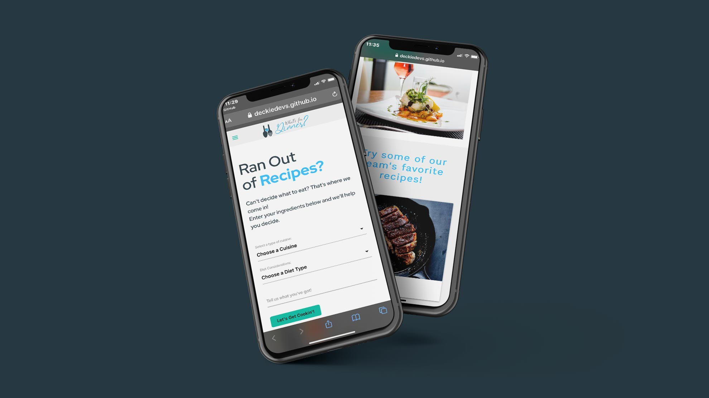

### A Full Stack Web Development group [project](https://github.com/valiantcreative33/whats-for-dinner) created during my coding Boot Camp at the University of Central Florida.

Are you stumped with the never-ending question of “What’s for dinner?” from your significant other or kids? We’ve all been there. Long commutes, even longer work days, shuttling your kids to and from school and extracurricular activities. The daily hustle and bustle of life. That’s where we come in! Let us save you the hassle of trying to figure it out. Head on over to our site and use the search bar to enter ingredients you already have on hand and we’ll give you a selection of recipes to choose from. Dietary restrictions? Picky eaters? We’ve got you covered there too! So leave your worries and stress behind and let us help you pick “What’s for Dinner?”

This was a project I collaborated on while undergoing a Full Stack Web Development Boot Camp at the University of Central Florida. My primary role here was as the Front End Developer. I Personally designed the logo and lead the majority of the UI/UX of the entire application, as well as hand coded the majority of the Front End.

View the live project [here](https://deckiedevs.github.io/whats-for-dinner/).

